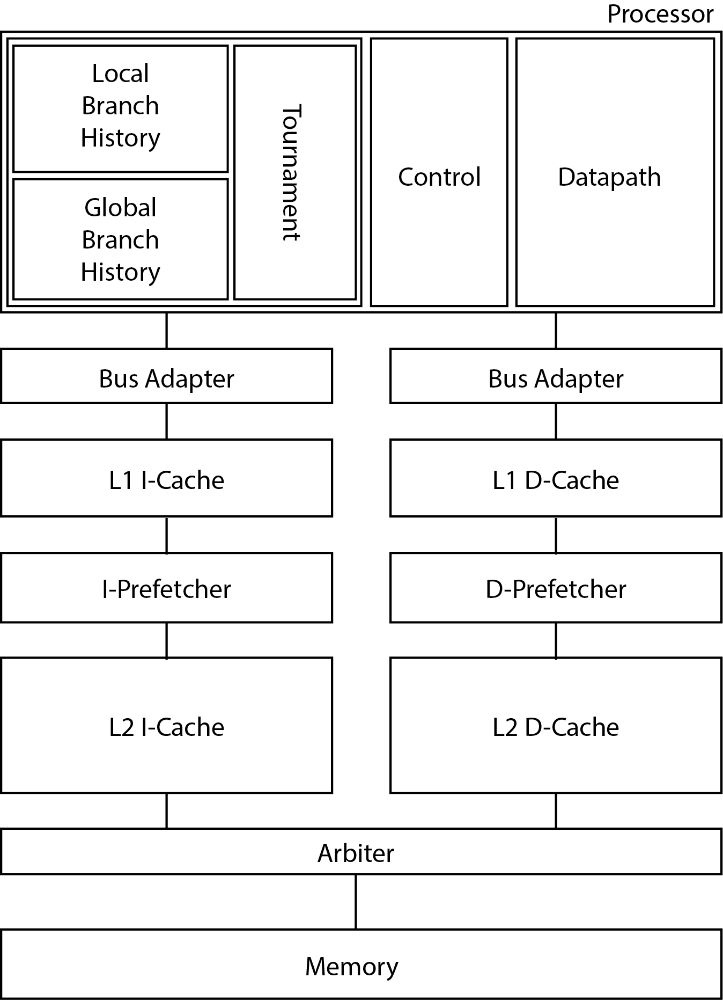

A pipelined RV32I processor implemented in SystemVerilog as UIUC ECE411 Computer Organization and Design FA20 final project.

## Features

* 5-stage pipeline with data forwarding and hazard detection
* Branch prediction
  * Local Branch History Table
  * Global Branch History Table
  * Tournament Branch Predictor
* Caches
  * One-cycle L1 I-Cache and D-Cache
  * Two-cycle L2 I-Cache and D-Cache using BRAM
  * Parameterized number of ways (2, 4 or 8) with pseudo LRU
  * Parameterized set number
  * Single unified parameterized module with all the configurable parameters above
* Prefetch
  * Passing signal down in normal read state
  * Fetch next line immediately after the current read (in prefetch state)
  * Block new read during the prefetch
* Performance counters

## Authors
Team _0_warning_0_error_:

* Zikai Liu (zikail2@illinois.edu)
* Kerui Zhu (keruiz2@illinois.edu)
* Kaiwen Cao (kaiwenc2@illinois.edu)

## Organization

## Miscellaneous
* See [our presentation](ECE%20411%20Presentation.pdf) for an overview of the performance of our processor.
* Original [ECE411 MP4 README](mp4/README.rst).