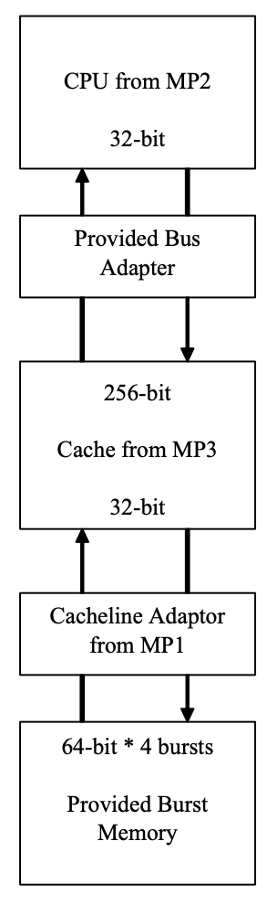
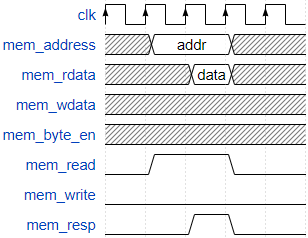
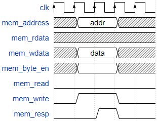
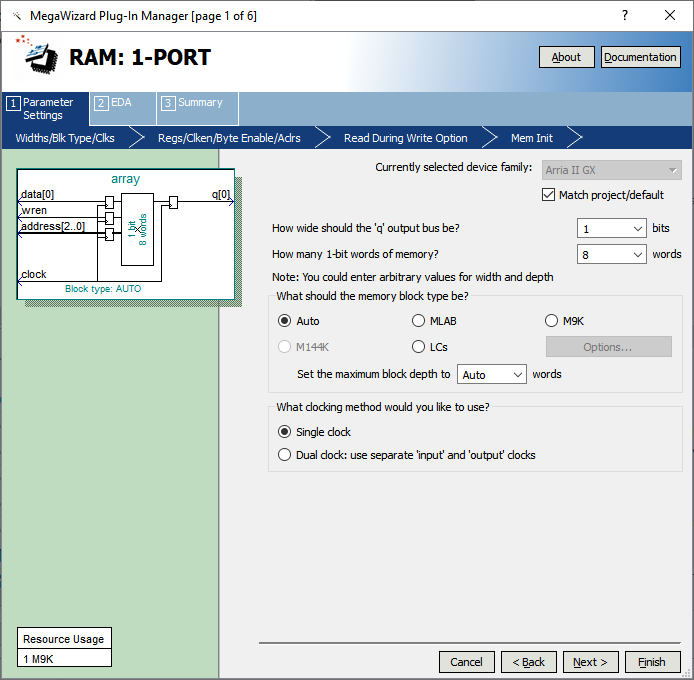
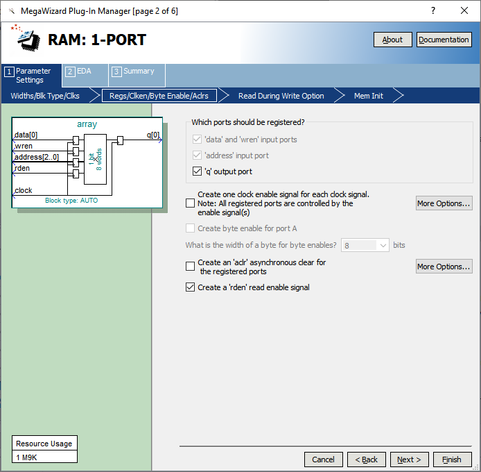
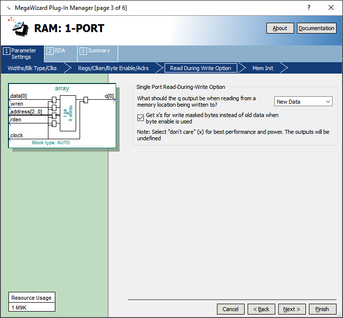
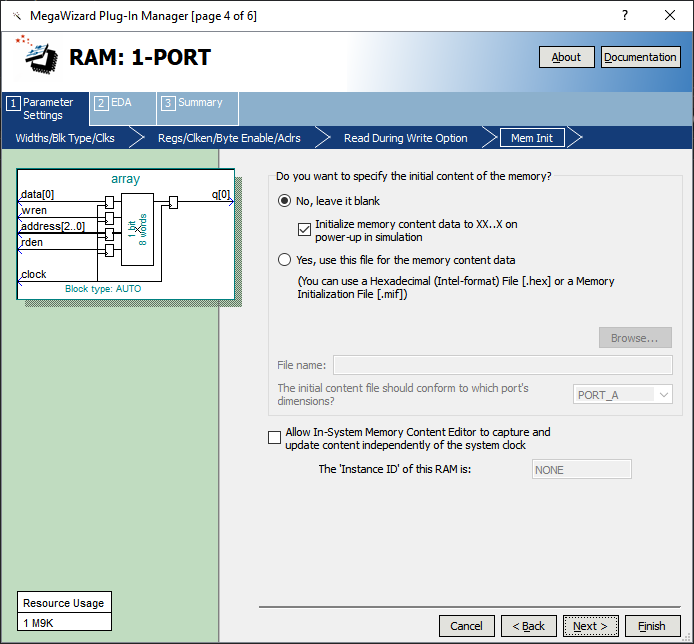
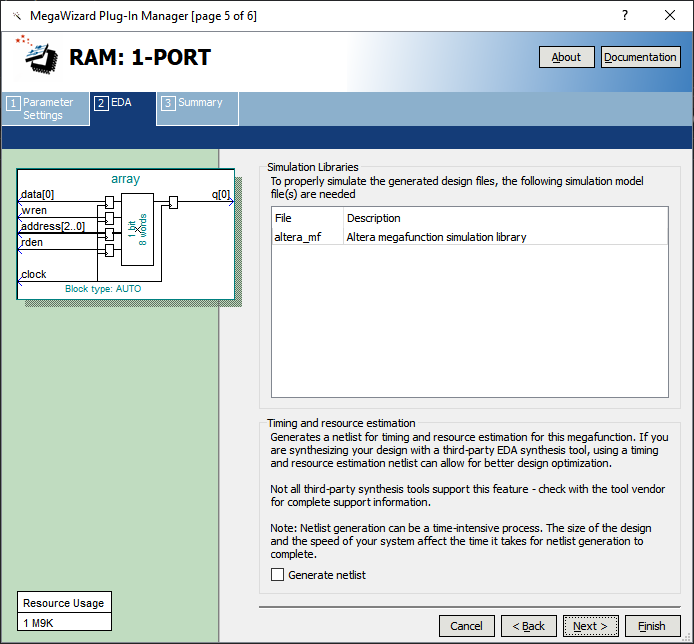
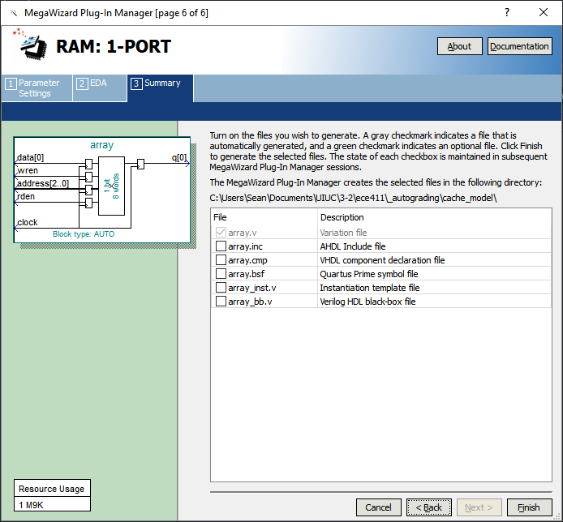

==========================
ECE 411: MP3 Documentation
==========================

--------------------------------------------------------------
The RV32I Processor with a Unified 2-Way Set-Associative Cache
--------------------------------------------------------------

    The software programs described in this document are confidential and proprietary products of
    Altera Corporation and Mentor Graphics Corporation or its licensors. The terms and conditions
    governing the sale and licensing of Altera and Mentor Graphics products are set forth in written
    agreements between Altera, Mentor Graphics and its customers. No representation or other
    affirmation of fact contained in this publication shall be deemed to be a warranty or give rise
    to any liability of Altera and Mentor Graphics whatsoever. Images of software programs in use
    are assumed to be copyright and may not be reproduced.

    This document is for informational and instructional purposes only. The ECE 411 teaching staff
    reserves the right to make changes in specifications and other information contained in this
    publication without prior notice, and the reader should, in all cases, consult the teaching
    staff to determine whether any changes have been made.

.. contents:: Table of Contents
.. section-numbering::

-----

Introduction
============

MP2 left you with a working machine that implements the RV32I Instruction Set. Now that we have a
machine that we can fully program and operate, we can start to look at performance. As you may have
noticed, the memory in MP2 included a delay before responding. In the real world, main memory
access takes a long time relative to the length of the processor clock; and it takes even more
cycles in high-end microprocessors. In fact, the relative speed difference between processors and
memory has been growing over time and developing techniques for overcoming this difference is very
important. Memory caches are therefore vital for achieving high performance. To help you gain a
more detailed understanding of caches, you will be augmenting
the RV32I design from MP2 with a simple one-level cache. Refer to the `Cache Specifications`_
section for the design details.

Once again, this handout is only intended to help you get started. You are responsible for
implementing the additions and modifications to the MP2 design on your own. We discussed cache
design in lectures. In addition, textbooks may have helpful information on caches. We have put
together some information to help you get started in the `Getting Started`_ section of this
document. **Only start this MP3 when you have a correct implementation of MP2 and the MP1 cachline
adapter.** Refer to the `RISC-V specification`_ for ISA concerns.

.. _RISC-V specification: https://content.riscv.org/wp-content/uploads/2017/05/riscv-spec-v2.2.pdf

**You are strongly encouraged to write your own test code to test your implementation and not wait
until we release ours. This includes verifying not only instruction implementation but cache
correctness as well.**

Grades will be based mainly on the correctness of your design and thoroughness of verification. Some
points may be allocated to your skills to execute the hand-in requirements.

MP3 Design Diagram
----------------

   Figure 1: MP3 overview diagram.

Cache Specifications
====================

You will need to design (and verify) a **one-level, unified, 2-way set-associative cache** with the
following specifications:

- 8 sets with 2 ways per set
- Each way holds an 8-word cache line
- Write-back with a write allocate policy
- LRU replacement policy
- Read/Write hits must take at most two clock cycles to complete
- Set/index bits must come from the address bits directly adjacent to the offset bits

Previously, the CPU datapath was interacting with the main memory directly. Now, you will need to
modify the interface to implement the memory hierarchy. That is, you will need to insert a cache
between the CPU's datapath and the main memory.  **You may NOT add additional signals between the
cache and the CPU datapath.** Your cache must work with the same signals that MP2 main memory used
to communicate with the CPU; the datapath must have no knowledge of your memory hierarchy. The
signals used are described in the `Signal Specifications`_ section below.

In MP3, the main memory code will be provided as ``physical_memory.sv``. This memory module has a
slightly increased delay. The memory bandwidth has been
increased to 256 bits, so that a single load will fill an entire cache line. The new memory will
only allow reads and writes of cache line-sized data (8 words or 256 bits). Additionally, reads
and writes occur in bursts over 4 cycles, requiring the use of your cache line adapter from MP1.

The cache must be constructed using only the following components:

- Control unit (you must create a state diagram for this)
- Decoders
- Comparators
- Muxes
- Cacheline adaptor (taken from your MP1 design)
- 4 byte to 32 byte bus adapter (provided as ``bus_adapter.sv``)
- 2 data arrays (provided as ``data_array.sv``)
- Metadata arrays (provided as ``array.sv``):

  - 2 tag arrays
  - 2 valid bit arrays
  - 2 dirty bit arrays
  - LRU bit array

- Logic gates
- Registers (provided as ``register.sv`` from MP2)

**Do not modify the provided modules.** All provided code will be replaced with clean copies by the
autograder, so any modifications will be overwritten.

You may optionally use BRAM for your arrays, which will offer faster speed and faster synthesis time for your cache at scale (larger caches). See `Appendix B: Instantiating BRAM Arrays` to learn
how to instantiate BRAM with Quartus.

Read/Write hits **MUST** take at most two clock cycles to complete in this cache. Other operations
may take multiple cycles, if necessary. A good way to test for a 2-cycle hit is to look at the IF2 (IF, instruction fetch)
state for an instruction that should be in the cache. IF2 in this case should be exactly twice as
long as IF1.
The two cycle requirement implies your controller signals should go high towards the beginning of the first cycle, and your cache should raise its resp (on a hit) towards the end of the second cycle.

A cache with a two-cycle hit will follow the following diagrams:

   Read hit diagram.

   Write hit diagram.

Signal Specifications
=====================

Memory Hierarchy Signals
------------------------

These signals define the interface between the CPU datapath and the memory hierarchy. Each of these
signals must be present, and no additional signals are allowed. The main memory has its own set of
signals, which are also detailed below.

Signals between CPU Datapath and Cache
^^^^^^^^^^^^^^^^^^^^^^^^^^^^^^^^^^^^^^

``mem_address[31:0]``
  The memory system is accessed using this 32 bit signal. It specifies the address that is to be
  read or written.

``mem_rdata[31:0]``
  32-bit data bus for receiving data *from* the memory system.

``mem_wdata[31:0]``
  32-bit data bus for sending data *to* the memory system.

``mem_read``
  Active high signal that tells the memory system that the address is valid and the processor is
  trying to perform a memory read.

``mem_write``
  Active high signal that tells the memory system that the address is valid and the processor is
  trying to perform a memory write.

``mem_byte_enable[3:0]``
  A mask describing which byte(s) of memory should be written on a memory write. The behavior of
  this signal is summarized in the following table:

  =====================  ==========
   ``mem_byte_enable``    Behavior
  =====================  ==========
   ``4'b0000``            Don't write to memory even if ``mem_write`` becomes active
   ``4'b????``            Write only bytes specified in the mask (by a 1) when ``mem_write`` becomes
                          active
   ``4'b1111``            Write all bytes of a word to memory when ``mem_write`` becomes active
  =====================  ==========

``mem_resp``
  Active high signal generated by the memory system indicating that the memory has finished the
  requested operation.

Signals between Cache and Main Memory
^^^^^^^^^^^^^^^^^^^^^^^^^^^^^^^^^^^^^

``pmem_address[31:0]``
  Physical memory is accessed using this 32-bit signal. It specifies the physical memory address
  that is to be read or written.

``pmem_rdata[63:0]``
  64-bit data bus for receiving data *from* physical memory.

``pmem_wdata[63:0]``
  64-bit data bus for sending data *to* physical memory.

``pmem_read``
  Active high signal that tells physical memory that the address is valid and the cache is trying to
  perform a physical memory read.

``pmem_write``
  Active high signal that tells physical memory that the address is valid and the cache is trying to
  perform a physical memory write.

``pmem_resp``
  Active high signal generated by physical memory indicating that the memory operation is executing.
  This signal will stay high for 4 cycles during a single read or write.

Memory Interaction
------------------

The main memory takes multiple cycles to respond to requests. When a response is ready, the memory
will assert the ``mem_resp`` signal. Once a memory request is asserted, the input signals to memory
should be held constant until a response is received. You may assume in your design that the memory
response will always occur so the processor never has an infinite wait. As before, make sure that
you never attempt to read and write to memory at the same time.

Getting Started
===============

Since MP3 is an extension of the work done in MP2, you should copy your completed MP2 design into a
new folder for MP3. The steps for copying and beginning MP3 are below.

Obtaining the Starter Code
--------------------------

1. Merge the provided MP3 files into your repository::

     $ cd <411 git repository>
     $ git fetch release
     $ git merge --allow-unrelated-histories release/mp3 -m "Merging MP3"

2. Copy your MP1 cache line adapter design into your MP3 directory::

     $ cp -pn mp1/cacheline_adaptor/hdl/cache/cacheline_adaptor.sv mp3/hdl # -p preserves file attributes, -n prevents overwriting files

3. Copy your MP2 design into your MP3 directory. Note that we have given you fresh copies of the
   provided CPU files. Do not overwrite these as the autograder will use clean copies and your
   design may break::

     $ cp -pn mp2/hdl/* mp3/hdl/cpu
     $ cp -pn mp2/testcode/* mp3/testcode    # optional, do this if you wrote your own tests

4. In the new MP3 directory, change all references to mp2 to refer to mp3 instead (e.g. ``mp3_tb``
   instead of ``mp2_tb``, ``mp3.sv`` instead of ``mp2.sv``, etc.). You can do this manually or try
   to use the ``rereference.sh`` script::

     $ cd mp3
     $ ./bin/rereference.sh . mp2 mp3

5. Ensure the ``DEFAULT_TARGET`` variable in the ``bin/rv_load_memory.sh`` script is correct so that
   the memory initialization file is written to the MP3 simulation directory. Furthermore, change
   the access granularity of the memory to correspond to the updated physical memory (256 bits == 32
   bytes)::

     # Settings
     ECE411DIR=$HOME/ece411
     DEFAULT_TARGET=$ECE411DIR/mp3/simulation/modelsim/memory.lst
     ASSEMBLER=/class/ece411/software/riscv-tools/bin/riscv32-unknown-elf-gcc
     ADDRESSABILITY=32

6. Remove any duplicated files that may have been added by both MP2 and MP3. Particularly,
   ``rv32i_*types.sv``, which we copied into ``/mp3/hdl/cpu`` and was provided in ``/mp3/hdl``. You
   should keep the most recent version of any such file, i.e. the one distributed with MP3.

   This step is particularly important as the autograder will not use your QPF file but will instead
   create its own by including all ``.sv`` files in the MP3 directory tree.  If you have duplicate
   files, the autograder will fail due to multiple definitions of the same type.

Description of Provided Files
-----------------------------

The following files are provided in ``/mp3/hdl/cache``

``array.sv``
  A register array to be used for tag arrays, LRU array, etc.

``bus_adapter.sv``
  A module to help your CPU (which likes to deal with 4 bytes at a time) talk to your cache (which
  likes to deal with 32 bytes at a time). Do not modify.

``cache.sv``, ``cache_control.sv``, ``cache_datapath.sv``
  Some blank modules to help you get started.

``data_array.sv``
  A special register array specifically for your data arrays. This module supports a write mask to
  help you update the values in the array.

The following files are provided in ``/mp3/hvl`` and will be overwritten by the autograder

``top.sv``
  Testbench to simulate your MP3 design.  Your design must adhere to the naming conventions dictated
  by this file.  Namely, you must match the name of the register file, IR, data arrays, tag arrays,
  CPU, cache, CPU datapath, cache datapath, and MP3 top level modules as well as the identifier
  hierarchy imposed by the monitor. **Failure to follow these conventions will result in compilation
  errors in the autograder.**

``param_memory.sv``
  The main memory module, with delay, which will be connected to your cache. This memory is
  different than that provided in MP2 in that its access granularity is now 32-byte.

``rvfimon.v``
  RVFI verification monitor. Same as MP2.

``shadow_memory.sv``
  Similar to the RVFI verification monitor, this module will help detect errors in your cache. The
  RVFI monitor aims to be synthesizable, which means it is impossible for it to keep track of memory
  state. This module does not aim to be synthesizable so it is able to maintain a copy of memory
  which updates every time the CPU performs a write. Refer to this file to see how the testbench and
  autograder expect memory to be formatted coming out of your cache.

``tb_itf.sv`` and ``source_tb.sv``
  The interface used to connect the memory and DUT in the testbench.

  ``cache_monitor_itf.sv``
  The interface used to connect the cache and DUT in the testbench.

Finally, we also provide the following in ``/mp3/hdl``

``mp3.sv``
  A bare top level module to help you get started. Do not change the names of the cpu or cache
  instances.

``rv32i_mux_types.sv``, ``rv32i_types.sv``
  Enumerated type definitions to improve the readability of your code and waveforms. If you want to
  define your own types, create a new file as these will be overwritten by the autograder.

We have also provided fresh copies of the given MP2 files in ``/mp3/hdl/cpu``.  If you followed the
directions in `Obtaining the Starter Code`_, then your full MP2 design should be available in this
directory.

Beginning the New Design
------------------------

To organize your MP3 design, we recommend that you organize your component files in the following
manner (most of these files are already in place):

``/hdl/mp3.sv``
  Your MP3 design. It contains the CPU and cache, with input/output ports for physical memory.

``/hdl/cache/cache.sv``
  Your cache design. It contains the cache controller, cache datapath, and bus adapter.

``/hdl/cache/cache_control.sv``
  The cache controller. It is a state machine that controls the behavior of the cache.

``/hdl/cache/cache_datapath.sv``
  The cache datapath. It contains the data, valid, dirty, tag, and LRU arrays, comparators, muxes,
  logic gates and other supporting logic.

``/hdl/cpu/cpu.sv``
  Your MP2 CPU design. It contains the CPU controller and CPU datapath. Note: you have to rename your mp2 module to 'cpu'.

``/hdl/cpu/cpu_control.sv``
  The CPU controller. It is a state machine that controls the CPU datapath. Same as MP2.

``/hdl/cpu/cpu_datapath.sv``
  The CPU datapath. Same as MP2.

``/hvl/top.sv``
  The testbench. It contains the MP3 design and physical memory, as well as the RVFI monitor and
  shadow memory for verification.

These files are the upper hierarchy of the design, and you will be creating more files for lower-
level components. You can define your own interface, but you need to make sure it is easily
understood by others.

Once you have set up the interface correctly, you can start to work on the implementation.

The last thing you must do is to confirm the target FPGA for the project. The FPGA you should target for
this is the **Arria II GX EP2AGX45DF25I3** (this should have been set in MP0).

A Note about Alignment
----------------------
In MP2, your design had to work with a memory module that only allowed aligned accesses. As in MP2,
all memory accesses will be aligned to their respective data sizes.  That is, word accesses (``lw``/
``sw``) will be 4-byte aligned and halfword accesses (``lh``/``lhu``/``sh``) will be 2-byte aligned.
If this were not the case, a single memory access could span multiple cache lines, which is beyond
the scope of this assignment.  Byte accesses (``lb``/``lbu``/``sb``) will never span cache lines, so
we may test any alignment for these. The RVFI monitor will enforce proper word aligned memory
access, which requires you to ensure the bottom two bits of ``mem_address`` between the CPU and
cache zero'd and your ``mem_byte_enable`` is correctly set.

Design Limitations
==================

Things you must not do
----------------------

- **DO NOT** start working on MP3 without being sure your MP2 works. While you can (and should) test
  your cache without the CPU, you will ultimately need to ensure that your designs work correctly
  together. The autograder for MP2 will continue running until MP3 CP1 is due to help you debug your
  design.

- **DO NOT** make any changes to the CPU datapath or CPU controller beyond those required to fix bugs
  from MP2. Your CPU should have no knowledge of the memory hierarchy attached to it. If you find
  yourself changing your CPU to accommodate your cache, you've done something wrong.

- **DO NOT** model the cache as a single SystemVerilog component, i.e. making a single component and
  then writing SystemVerilog code to model the cache behaviorally.

- **DO NOT** modify the provided files. Most of them will be overwritten by the autograder, including:

  - ``mp3.qsf``
  - ``mp3.qpf``
  - ``hdl/rv32i_mux_types.sv``
  - ``hdl/rv32i_types.sv``
  - ``hdl/cache/bus_adapter.sv``
  - ``hdl/cpu/alu.sv``
  - ``hdl/cpu/ir.sv``
  - ``hdl/cpu/pc_reg.sv``
  - ``hdl/cpu/regfile.sv``
  - ``hdl/cpu/register.sv``

  Please watch Piazza, as the set of replaced files may be changed, or updates may be made to given
  files, and an announcement will be made.

Things you must do
------------------

- **DO** implement your cache controller with **at most** 5 states.
  
- **DO** implement your cache as small components that do simple work and connect them to form the
  complete design. As stated in the list of `Cache Specifications`_, you will need to create low-
  level components (e.g. decoders, logic blocks, etc.) and connect them in upper level components
  like ``cache.sv``.

- **DO** follow the required naming conventions. For the autograder to work properly, you must rename
  your top level MP2 module from ``mp2`` to ``cpu``. You should maintain all other names you have
  currently working with the autograder, and check the provided test bench files for proper naming
  conventions for your cache modules and datapath.

- **DO** be sure to test your design with the RVFI monitor enabled, as the autograder will fail on any
  monitor errors.

- Again, you **MUST** ensure your module hierarchy and signal identifiers match those assumed by the
  ``shadow_memory`` and ``riscv_formal_monitor_rv32i`` modules in the MP3 testbench.

Checkpoints
===========

There will be three deadlines for MP3:

Design Checkpoint
----------------

For the first checkpoint, you will need to submit a **digital** design (ie. nothing hand-drawn) of your cache datapath and
cache controller (max 5 states) that shows that you have made significant progress on your design. What does significant
progress mean? Your paper design should be detailed enough for TAs to trace the execution of cache
reads and writes (with a similar level of detail as the given MP2 spec). It should show at least:

- how data is read from the data arrays on a read hit;
- how data is loaded into the data arrays from main memory on a read/write miss;
- how data is written to the data arrays on a write hit;
- how data is written from the data arrays to main memory on an eviction;
- how the LRU determines which way to use; and
- the cache controller with states, state descriptions, transition conditions, and output signals
  as a function of state (Moore machine) or as a function of state and input (Mealy machine).
- the cache datapath with explicitly labeled modules and signals from the controller or other modules

You may indicate the transition conditions and output signals however you wish, as long as it is
clear how the state machine operates. Any signals defined in the datapath that do not interface
with the CPU or memory must be listed in the controller, and vice versa. An interface listing may
be useful to show what signals are passing between the datapath and controller.

Your design should be detailed enough (i.e., any student taking this course can create an
identical cache based off of your design).

We include an **example design** for your reference while completing this checkpoint. See `Appendix C: Example Design Report`.

In addition to the 'paper' design, you should start planning how you will test your design. In no more than a single page, answer the following questions:

1. Address the following with **maximum 1-2 sentences** each:

    - Did you use randomized testing and if so, did it reveal any design flaws that you missed with targeted testing?
    - Did the autograder help alert you to the presence of bugs in your design (even if you didn't know where they were)?
    - Did the autograder help you identify bugs in your design (i.e. narrow the scope of testing)?
    - Did the autograder impact your testing methodology?

2. Analyze your cache design to identify **two edge cases** you will deliberately test.
3. Provide a **brief** description of how you will **test one** of your identified edge cases. This may be
   an English description or code, and may be RISC-V assembly or cache input stimuli.
4. **Briefly describe** how you will unit test your cache as the DUT itself, rather than as part of your
   processor.

Deliverables
^^^^^^^^^^^^
Upload, as a single PDF document, your design (datapath and controller) and testing analysis to
Compass before the posted deadline. Your testing analysis should not be longer than a single page
(not including test code).

Checkpoint One
-----------------

For the second checkpoint, you will be required to have **cache reads** working. The autograder will
only assign credit/no credit for this portion. If you want partial credit, you will need to meet
with a TA during office hours to verify that your reads are functioning correctly.

Timing analysis will run the day before the checkpoint is due and the final checkpoint run. However,
you will not be graded on your ability to meet the timing requirements for this checkpoint.

Deliverables
^^^^^^^^^^^^
Submit your design to Git by 11:59pm on the deadline. Your cache should be able to correctly execute
reads, including overwriting clean data in the cache.

Checkpoint Two
--------------

For the final hand-in, you should have a working processor supporting the full rv32i ISA and a
single-level, 2-way set associative, write-back cache.

We will provide you with a basic suite of test code, but you are responsible for the correctness of
your design. Passing the provided test codes does not necessarily mean that your design is working
in all cases. You need to write your own test code to cover more corner cases.

Deliverables
^^^^^^^^^^^^

You must commit **AND PUSH** your relevant files to your Git repository before the deadline. **You
must inlcude the timing constraints file with the filename mp3.out.sdc.** The autograder will use
the distributed version of any given files (from this or previous MPs), so your design should not
rely on any changes you make to those files. You should not upload any ``.sv`` files which are not
part of your project, as the autograder will assume these are meant to be compiled which could
generate grading errors.

Grading Rubric
==============

**Total: 120 points**

- Design Checkpoint: 24 points (20%)

  - Paper Design: 18 points (15%)
  - Testing Strategy: 6 points (5%)
  
- Checkpoint 1: 30 (25%)

  - Cache Reads: 30 points (25%)

- Checkpoint 2: 66 points (55%)

  - Targeted Tests: 36 points (30%)
  - Longer Test: 24 points (20%)
  - Timing Requirements: 6 points (5%)

Appendix A: RISC-V FENCE Instruction for those curious
=====

FENCE, as described by the RISC-V ISA Manual v2.2:

*The FENCE instruction is used to order device I/O and memory accesses as viewed by other RISCV harts and external devices or coprocessors. Any combination of device input (I), device output (O), memory reads (R), and memory writes (W) may be ordered with respect to any combination of the same. Informally, no other RISC-V hart or external device can observe any operation in the successor set following a FENCE before any operation in the predecessor set preceding the FENCE. The execution environment will define what I/O operations are possible, and in particular, which load and store instructions might be treated and ordered as device input and device output operations respectively rather than memory reads and writes. For example, memory-mapped I/O devices will typically be accessed with uncached loads and stores that are ordered using the I and O bits rather than the R and W bits. Instruction-set extensions might also describe new coprocessor I/O instructions that will also be ordered using the I and O bits in a FENCE.* 

Put simply (and interpreted loosely), the FENCE typically implies that prior memory modifications be made consistent with the memory any other potential devices share. For purposes of the simple ECE 411 single core, this can be interpreted as a cache flush, through which the main memory the processor is interfacing with should reflect any changes to memory which may currently only exist within the cache hierarchy. This is primarily a concern for processors with more room for instruction reordering, but still has relevance in the theoretical context that the student’s risc-v processor is in a larger shared memory system.

Appendix B: Instantiating BRAM Arrays
=====

For this MP, you may use BRAM modules for your data arrays. Quartus provides an easy way to
instantiate BRAM modules.

In the top menu bar, go to Tools > IP Catalog. Select Installed IP > Library > Basic Functions
> On Chip Memory > RAM 1-PORT.

.. figure:: doc/figures/IP-Catalog.png
   :align: center
   :width: 80%
   :alt: IP Catalog Menu

   Figure 1: IP Catalog Menu.

Specify a location and file name for the module, and select Verilog for the IP variation file type.
As the file type is Verilog, use .v as the file format.

For Parameter Settings, in Widths/Blk Type/Clks, specify the output width and number of words for
the array **depending on which array you want to instantiate** (data, tag, valid, dirty, lRU). You can
manually type in any value.
Select Auto for the memory block type, and use a single clock for the module.

   Figure 2: Specify input/output width and number of words in the array.

In Regs/Clken/Byte Enable,/Aclrs, you may choose to check the 'Create a 'rden' read enable signal'
option. This allows you to control when the array is read from.

   Figure 3: Select "Create a 'rden' read enable signal."

   Figure 4: Leave these options as their default.

In Mem Init, check the 'Initialize memory content data to XX...X on power-up in simulation.' This will
assist in debugging in case you attempt to read from uninitialized entries.

   Figure 5: Check "initialize memory content data to XX...X on power-up in simulation."

   Figure 6: No options needed here.

In Summary, you'll only need to check the the variation file.

   Figure 7: Leave only the Variation file checked.

Click Finish and the new module can be found in your specified location.

Appendix C: Example Design Report
=====

Below is an example digital design of MP2, the multicycle RISC-V processor. Your cache design should be much simpler
than this, but we use it as an example in how to format your digital design. It is split into two sections, 
datapath and controller. As long as it is clear, it is only necessary to provide the design diagram for your 
datapath. The controller needs a bit more more information then just a state diagram, as shown below:

Datapath
--------

.. figure:: doc/figures/mp2_datapath.png
   :align: center
   :width: 80%
   :alt: Summary

Controller
----------

.. figure:: doc/figures/mp2_controller.png
   :align: center
   :width: 80%
   :alt: Summary

Each states are described in more detail below. Note, all control signals are by default 0. Any changes in those 
signals from default will be detailed in the output section of each state.

FETCH1
^^^^^^
| **Description**: The first state necessary to fetch a program instruction from memory. Will request the word at the address of the current PC.
| **Transitions**: 
| - Always -> FETCH2
| **Outputs**: 
| - load_mar = 1 
| - mem_read = 1 

FETCH2
^^^^^^
| **Description**: The second state necessary to fetch a program instruction from memory. Will wait until the instruction is returned from memory.
| **Transitions**:  
| - if(mem_resp == 1) -> DECODE 
| - if(mem_resp == 0) -> FETCH2 
| **Outputs**: 
| - load_mdr = 1 
| - mem_read = 1 

DECODE
^^^^^^
| **Description**: The state necessary for decoding the fetched instruction into the control signals necessary to correctly set the processor to compute the instruction.
| **Transitions**:
| - if(op == op_lui) -> LUI
| - if(op == op_auipc) -> AUIPC
| - <and so on...> 
| **Outputs**:
| - Default

OTHER_STATES
^^^^^^^^^^^^
| <continue on for other states>

Notes
=====

This document is written in reStructuredText (rst), a markup language similar to Markdown, developed
by the Python community. rst files are automatically rendered by Github, so you shouldn't need to
download or save anything to see the documentation.  However, if you would like an offline version
of the file, you may use the HTML version in the MP directory. Follow the steps below to generate
your own HTML or PDF version.

Install Python docutils if not already installed::

  $ sudo pip3 install docutils

Use a docutils frontend to convert rst to another format::

  $ rst2html5 README.rst MP3_spec.html
  $ rst2latex README.rst MP3_spec.tex

If creating a PDF using LaTeX, you will need a TeX distribution installed. You can then use::

  $ pdflatex MP3_spec.tex

Note that this document was optimized for viewing online in the Github repository. Generated HTML
files should match pretty closely to what you will see on Github, perhaps with different styles.
PDF documents will likely look different though, so use at your own risk.

See the `Docutils Front-End Tools`__ for more details.

__ http://docutils.sourceforge.net/docs/user/tools.html
